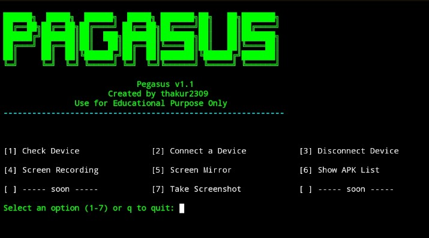
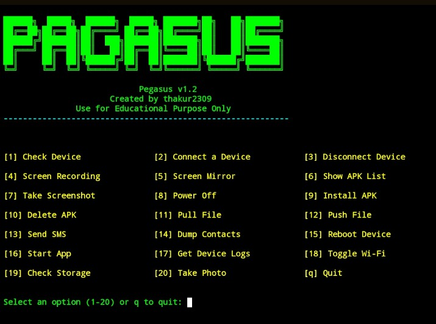

<div align="center">

```
██████╗ ███████╗ ██████╗  █████╗ ███████╗██╗   ██╗███████╗
██╔══██╗██╔════╝██╔════╝ ██╔══██╗██╔════╝██║   ██║██╔════╝
██████╔╝█████╗  ██║  ███╗███████║███████╗██║   ██║███████╗
██╔═══╝ ██╔══╝  ██║   ██║██╔══██║╚════██║██║   ██║╚════██║
██║     ███████╗╚██████╔╝██║  ██║███████║╚██████╔╝███████╗
╚═╝     ╚══════╝ ╚═════╝ ╚═╝  ╚═╝╚══════╝ ╚═════╝ ╚══════╝
```

# PEGASUS v1.3

**Android Device Management & Security Audit Tool**

[](https://python.org)
[](https://github.com/thakur2309/PAGASUS-PRO)
[](https://developer.android.com/tools/adb)
[](https://github.com/thakur2309/PAGASUS-PRO/releases)
[](./LICENSE)
[](https://github.com/thakur2309/PAGASUS-PRO/stargazers)

<br/>

> 🛡️ **For Educational & Personal Use Only**  
> Use only on devices you own or have explicit written permission to access.

<br/>

[Features](#-features) • [Screenshots](#-screenshots) • [Installation](#-installation) • [Usage](#-usage) • [Device Setup](#-android-device-setup) • [Changelog](#-changelog) • [License](#-license)

</div>

---
## 🗝️ Licence key
- 🔐 Licence key - `FIREWALLBREAKER`
- 📌 Instagram Username `sudo_xploit`
  
- 👉 [Instagram](https://www.instagram.com/sudo_xploit?igsh=MWN0YWc3N2JyenhoNw==)

---

## 📌 What is Pegasus?

**Pegasus** is a powerful Python-based Android Device Management and Security Audit tool built on top of **ADB (Android Debug Bridge)**. It provides an interactive, color-coded terminal menu to remotely manage, monitor, analyze, and audit Android devices — entirely from your PC, with no third-party app required on the phone.

### Who is it for?

| Audience | Use Case |
|----------|----------|
| 🧑‍💻 Android Developers | Quick device control and log monitoring during development |
| 🔐 Security Researchers | Audit and assess your own device's security posture |
| 🎓 Students | Learn Android internals, ADB commands, and mobile security |
| 🖥️ Power Users | Manage and control phones wirelessly over Wi-Fi |

---

## ✨ Features

### 📱 Device Management

| Option | Feature | Description |
|--------|---------|-------------|
| 1 | **Check Device** | View model name, Android version, and battery level |
| 2 | **Connect Device** | Connect via USB or wirelessly over Wi-Fi (TCP/IP) |
| 3 | **Disconnect Device** | Cleanly disconnect wireless ADB sessions |
| 4 | **Screen Recording** | Record device screen and auto-pull to your PC |
| 5 | **Screen Mirror** | Live real-time screen mirroring via `scrcpy` |
| 6 | **Show APK List** | List all installed packages, export clean list to file |
| 7 | **Take Screenshot** | Capture and pull screenshot instantly |
| 8 | **Power Off** | Remotely power off the device |
| 15 | **Reboot Device** | Remotely reboot the device |
| 18 | **Toggle Wi-Fi** | Enable or disable device Wi-Fi remotely |
| 19 | **Check Storage** | View storage usage in human-readable format |
| 20 | **Take Photo** | Trigger camera, capture photo, and auto-pull to PC |
| 21 | **Troubleshoot** | Kill and restart ADB server for connection issues |
| 23 | **Connection History** | View session connect/disconnect timestamps |

### 📦 App Management

| Option | Feature | Description |
|--------|---------|-------------|
| 9 | **Install APK** | Sideload and install any `.apk` from your PC |
| 10 | **Delete APK** | Uninstall any package by its package name |
| 16 | **Start App** | Launch any installed application remotely |

### 📂 File Transfer

| Option | Feature | Description |
|--------|---------|-------------|
| 11 | **Pull File** | Copy any file from device storage to PC |
| 12 | **Push File** | Copy any file from PC to device storage |

### 📋 Data & Logs

| Option | Feature | Description |
|--------|---------|-------------|
| 13 | **Send SMS** | Open SMS intent with pre-filled number and message |
| 14 | **Dump Contacts** | Extract contacts (Name + Number), save to `.txt` |
| 17 | **Get Device Logs** | Pull full `logcat` dump and save locally |

### 🔐 Advanced Security Audit *(Option 22)*

> Unlocks a dedicated penetration testing and security audit submenu.

| Sub-Option | Feature | Description |
|-----------|---------|-------------|
| 1 | **Root Detection** | Detect if device has been rooted via multiple methods |
| 2 | **APK Permissions Dump** | List all dangerous permissions granted per installed app |
| 3 | **Device Security Audit** | Check patch level, encryption state, and build tags |
| 4 | **Debuggable Apps Scanner** | Identify debug-enabled apps (common security risk) |
| 5 | **Interactive ADB Shell** | Open a live terminal shell session on the device |
| 6 | **Network Security Check** | Inspect Wi-Fi security type + optional `nmap` scan |
| 7 | **Dump SMS / Call Logs** | Export messages and call records to `.txt` files |
| 8 | **Security Log Filter** | Filter `logcat` for permission denials and security events |
| 9 | **Vulnerability Scanner** | Compare patch date against known risk threshold |
| 10 | **Network Connections Monitor** | View active network connections via `netstat` |

---

<div align="center">
  
## Main Menu — Pegasus v1.1
  


## Main Menu — Pegasus v1.2



## Main Menu — Pegasus v1.3


</div>

---

## 💻 Installation

### ⚡ One-Line Quick Install

| Platform | Command |
|----------|---------|
| **Ubuntu / Debian / Kali** | `sudo apt install -y python3 adb scrcpy git && git clone https://github.com/thakur2309/PAGASUS-PRO.git && cd PAGASUS-PRO && pip3 install -r requirements.txt && python3 pegasus_v_1.3.py` |
| **Arch / Manjaro / BlackArch** | `sudo pacman -S python android-tools scrcpy git && git clone https://github.com/thakur2309/PAGASUS-PRO.git && cd PAGASUS-PRO && pip install -r requirements.txt && python3 pegasus_v_1.3.py` |
| **macOS** | `brew install python android-platform-tools scrcpy git && git clone https://github.com/thakur2309/PAGASUS-PRO.git && cd PAGASUS-PRO && pip3 install -r requirements.txt && python3 pegasus_v_1.3.py` |
| **Windows** | Install Python + ADB manually (see guide below), then: `git clone https://github.com/thakur2309/PAGASUS-PRO.git && cd PAGASUS-PRO && pip install -r requirements.txt && python pegasus_v_1.3.py` |
| **📱 Termux (Android)** | `pkg update && pkg install python git android-tools && git clone https://github.com/thakur2309/PAGASUS-PRO.git && cd PAGASUS-PRO && pip install -r requirements.txt && python pegasus_v_1.3.py` |

---

### 🐧 Linux — Ubuntu / Debian / Kali

**Step 1 — Update system packages**
```bash
sudo apt update && sudo apt upgrade -y
```

**Step 2 — Install Python 3**
```bash
sudo apt install python3 python3-pip -y
```

**Step 3 — Install ADB**
```bash
sudo apt install adb -y
```

**Step 4 — Install scrcpy** *(optional — for Screen Mirror)*
```bash
sudo apt install scrcpy -y
```

**Step 5 — Install nmap** *(optional — for Network Security Scan)*
```bash
sudo apt install nmap -y
```

**Step 6 — Clone the repository**
```bash
git clone https://github.com/thakur2309/PAGASUS-PRO.git
cd PAGASUS-PRO
```

**Step 7 — Run Pegasus v1.3**
```bash
python3 pegasus_v_1.3.py
```

> Want to run an older version?
> ```bash
> python3 pegasusV-1.2.py   # Run v1.2
> python3 pegasus_v1.1.py   # Run v1.1
> ```

---

### 🔷 Linux — Arch / Manjaro / BlackArch

**Step 1 — Update system**
```bash
sudo pacman -Syu
```

**Step 2 — Install Python and ADB**
```bash
sudo pacman -S python android-tools
```

**Step 3 — Install scrcpy** *(optional)*
```bash
sudo pacman -S scrcpy
```

**Step 4 — Install nmap** *(optional)*
```bash
sudo pacman -S nmap
```

**Step 5 — Clone the repository**
```bash
git clone https://github.com/thakur2309/PAGASUS-PRO.git
cd PAGASUS-PRO
```

**Step 6 — Run Pegasus v1.3**
```bash
python3 pegasus_v_1.3.py
```

> Want to run an older version?
> ```bash
> python3 pegasusV-1.2.py   # Run v1.2
> python3 pegasus_v1.1.py   # Run v1.1
> ```

---

### 🪟 Windows 10 / 11

**Step 1 — Install Python 3**

1. Download from: https://www.python.org/downloads/
2. Run the installer
3. ✅ **Check "Add Python to PATH"** before clicking Install

Verify in Command Prompt or PowerShell:
```cmd
python --version
```

> 💡 **PowerShell (winget) — One command install:**
> ```powershell
> winget install Python.Python.3.11
> ```

---

**Step 2 — Install ADB (Android Platform Tools)**

**Option A — Manual install:**
1. Download from: https://developer.android.com/tools/releases/platform-tools
2. Extract the `.zip` to a folder (e.g., `C:\platform-tools\`)
3. Add to Windows PATH:
   - Press `Win + S` → Search **"Environment Variables"**
   - Click **"Edit the system environment variables"**
   - Click **"Environment Variables"** → Under System Variables, select `Path` → **Edit**
   - Click **New** → Enter `C:\platform-tools`
   - Click **OK** on all windows

**Option B — PowerShell (winget) — Recommended:**
```powershell
winget install Google.PlatformTools
```
> ADB is automatically added to PATH — no manual setup needed.

Verify:
```cmd
adb version
```

---

**Step 3 — Install scrcpy** *(optional — for Screen Mirror feature)*

**Option A — Manual install:**
1. Download from: https://github.com/Genymobile/scrcpy/releases
2. Extract to a folder (e.g., `C:\scrcpy\`)
3. Add `C:\scrcpy\` to PATH using same method as Step 2

**Option B — PowerShell (winget) — Recommended:**
```powershell
winget install Genymobile.scrcpy
```

Verify:
```powershell
scrcpy --version
```

---

**Step 4 — Install Git** *(if not installed)*

**Option A — Manual install:**  
Download from: https://git-scm.com/download/win → Install with default options

**Option B — PowerShell (winget):**
```powershell
winget install Git.Git
```
Verify:
```powershell
git --version
```
---

**Step 5 — Install all tools at once (PowerShell — Fastest Method)**

Open PowerShell as Administrator and run this single command to install everything:
```powershell
winget install Python.Python.3 Google.PlatformTools Genymobile.scrcpy Git.Git
```
> ✅ This installs Python, ADB, scrcpy, and Git in one shot. Restart PowerShell after this.

---

**Step 6 — Clone the repository**

Open **Command Prompt** or **PowerShell**:
```powershell
git clone https://github.com/thakur2309/PAGASUS-PRO.git
cd PAGASUS-PRO
```

**Step 7 — Install Python dependencies**
```powershell
pip install -r requirements.txt
```

**Step 8 — Run Pegasus v1.3**
```powershell
python pegasus_v_1.3.py
```

> Want to run an older version?
> ```powershell
> python pegasusV-1.2.py   # Run v1.2
> python pegasus_v1.1.py   # Run v1.1
> ```

> 💡 **Tip:** Use **Windows Terminal** (free from Microsoft Store) for best color rendering.

---

### 🍎 macOS — Intel & Apple Silicon (M1/M2/M3)

**Step 1 — Install Homebrew** *(if not installed)*
```bash
/bin/bash -c "$(curl -fsSL https://raw.githubusercontent.com/Homebrew/install/HEAD/install.sh)"
```

**Step 2 — Install Python 3**
```bash
brew install python
```

Verify:
```bash
python3 --version
```

**Step 3 — Install ADB**
```bash
brew install android-platform-tools
```

Verify:
```bash
adb version
```

**Step 4 — Install scrcpy** *(optional)*
```bash
brew install scrcpy
```

**Step 5 — Install nmap** *(optional)*
```bash
brew install nmap
```

**Step 6 — Clone the repository**
```bash
git clone https://github.com/thakur2309/PAGASUS-PRO.git
cd PAGASUS-PRO
```

**Step 7 — Run Pegasus v1.3**
```bash
python3 pegasus_v_1.3.py
```

> Want to run an older version?
> ```bash
> python3 pegasusV-1.2.py   # Run v1.2
> python3 pegasus_v1.1.py   # Run v1.1
> ```

---

### 📱 Termux (Run Directly from Your Android Phone)

> **What is Termux?** Termux is an Android terminal emulator that provides a full Linux environment on your phone — no root required. You can run Pegasus directly from your Android device using Termux.

> ⚠️ **Note:** `scrcpy` (Screen Mirror — Option 5) does **not work** in Termux because it requires a display server which is not available on Android. All other features work normally.

#### Install Termux

1. **Install Termux from F-Droid** *(Recommended)*  
   👉 https://f-droid.org/packages/com.termux/  
   > ⚠️ The Google Play Store version of Termux is outdated — always use the F-Droid version.

2. Open Termux and follow the steps below:

**Step 1 — Update packages**
```bash
pkg update && pkg upgrade -y
```

**Step 2 — Install Python**
```bash
pkg install python -y
```

**Step 3 — Install Git**
```bash
pkg install git -y
```

**Step 4 — Install ADB**
```bash
pkg install android-tools -y
```

Verify installation:
```bash
adb version
```

**Step 5 — Install nmap** *(optional — required for Network Security Scan)*
```bash
pkg install nmap -y
```

**Step 6 — Clone the repository**
```bash
git clone https://github.com/thakur2309/PAGASUS-PRO.git
cd PAGASUS-PRO
```

**Step 7 — Install Python dependencies**
```bash
pip install -r requirements.txt
```

**Step 8 — Run Pegasus v1.3**
```bash
python pegasus_v_1.3.py
```

> Want to run an older version?
> ```bash
> python pegasusV-1.2.py   # Run v1.2
> python pegasus_v1.1.py   # Run v1.1
> ```

---

#### 📡 How to Connect a Device in Termux

You can control another Android device from Termux using **Wi-Fi (Wireless ADB)**.

**Method 1 — Connect another device over Wi-Fi**

1. Enable USB Debugging on the target device (see [Android Device Setup](#-android-device-setup) section)
2. Connect the target device to your phone (running Termux) via USB cable
3. Run this command in Termux:
```bash
adb tcpip 5555
```
4. Unplug the USB cable, then find the target device IP:  
   → Settings → Wi-Fi → Tap connected network → IP Address
5. Run Pegasus and select **`[2] Connect a Device`**
6. Enter the IP address — wireless connection is now active ✅

**Method 2 — Manage the same device (localhost)**

If you want to manage your own phone directly:
```bash
adb connect localhost:5555
```
> ⚠️ This requires either a rooted phone or Wireless Debugging enabled (Android 11+ → Developer Options → Wireless Debugging).

---

#### ❌ What Does Not Work in Termux

| Feature | Status | Reason |
|---------|--------|--------|
| Screen Mirror (Option 5) | ❌ Not supported | `scrcpy` requires a display server |
| All other features | ✅ Fully supported | Runs entirely over ADB |

---

#### 💡 Termux Tips

- **Grant storage permission** (required for file pull/push features):
  ```bash
  termux-setup-storage
  ```
- **Keyboard shortcut:** Volume Down button acts as the Ctrl key
- **Prevent screen timeout:** Go to Settings → Display → Screen Timeout and increase the duration while using the tool
- **Better colors:** Install the **Termux:Styling** app from F-Droid for improved terminal color themes

---


USB Debugging must be enabled on your Android device before Pegasus can connect.

### Enable USB Debugging

```
Settings → About Phone
→ Tap "Build Number" 7 times rapidly
→ "You are now a developer!" message appears
→ Go back → Settings → Developer Options
→ Toggle ON "USB Debugging"
→ Connect phone to PC via USB
→ On phone popup: tap "Allow"
```

### Switch to Wireless Mode (Wi-Fi ADB)

> One-time USB setup required. After that, go fully wireless.

1. Connect device via USB cable
2. Launch Pegasus → Select **`[2] Connect a Device`**
3. Enter `y` when asked to enable TCP/IP mode
4. Find your device IP: **Settings → Wi-Fi → Tap connected network → IP Address**
5. Enter the IP in Pegasus when prompted
6. Unplug USB — connection is now wireless ✅

---

## 🚀 Usage

```bash
# Linux / macOS — Latest Version
python3 pegasus_v_1.3.py

# Windows — Latest Version
python pegasus_v_1.3.py

# Run older versions
python3 pegasusV-1.2.py    # v1.2
python3 pegasus_v1.1.py    # v1.1
```

**Main Menu Preview:**

```
══════════════════════════════════════════════════════════════

[1] Check Device           [2] Connect a Device      [3] Disconnect Device

[4] Screen Recording       [5] Screen Mirror          [6] Show APK List

[7] Take Screenshot        [8] Power Off              [9] Install APK

[10] Delete APK            [11] Pull File             [12] Push File

[13] Send SMS              [14] Dump Contacts         [15] Reboot Device

[16] Start App             [17] Get Device Logs       [18] Toggle Wi-Fi

[19] Check Storage         [20] Take Photo            [q] Quit

[21] Troubleshoot Connection

[22] Unlock Advanced Security Tools

[23] View Device Connection History

══════════════════════════════════════════════════════════════
```

---

## 📂 Output Files

All generated files are saved in the **same directory** where you run the script.

| Filename | Generated By |
|----------|-------------|
| `screen.png` | Take Screenshot |
| `record.mp4` | Screen Recording |
| `apk_list.txt` | Show APK List |
| `contacts.txt` | Dump Contacts |
| `device_log.txt` | Get Device Logs |
| `storage_info.txt` | Check Storage |
| `sms_logs.txt` | Dump SMS (Security Tools) |
| `call_logs.txt` | Dump Call Logs (Security Tools) |
| `connection_log.txt` | Auto-generated connection session log |

---

## 📋 Dependency Summary

| Dependency | Required | Purpose | Install (Linux/macOS) | Install (Termux) |
|-----------|----------|---------|-----------------------|-----------------|
| Python 3.7+ | ✅ Yes | Run the tool | `sudo apt install python3` | `pkg install python` |
| colorama | ✅ Yes | Color terminal output | `pip3 install colorama` | `pip install colorama` |
| ADB | ✅ Yes | Device communication | `sudo apt install adb` | `pkg install android-tools` |
| scrcpy | ⚪ Optional | Screen Mirror feature | `sudo apt install scrcpy` | ❌ Termux mein kaam nahi |
| nmap | ⚪ Optional | Network scan in Security Tools | `sudo apt install nmap` | `pkg install nmap` |
| Git | ⚪ Recommended | Clone the repository | `sudo apt install git` | `pkg install git` |

> 💡 **Shortcut:** `pip install -r requirements.txt` se sab Python dependencies ek baar mein install ho jaati hain.

---

## 📁 File Reference

| File | Version | Run Command |
|------|---------|-------------|
| `pegasus_v_1.3.py` | v1.3 *(Latest)* | `python3 pegasus_v_1.3.py` |
| `pegasusV-1.2.py` | v1.2 | `python3 pegasusV-1.2.py` |
| `pegasus_v1.1.py` | v1.1 | `python3 pegasus_v1.1.py` |
| `requirements.txt` | — | `pip install -r requirements.txt` |

---

## 📝 Changelog

### v1.3 — Latest Release
- ✅ **Advanced Security Tools submenu** added (Option 22) — 10 features:
  - Root Detection (multi-method), APK Permissions Audit, Full Security Audit
  - Debuggable Apps Scanner, Interactive Shell, Network Security Check
  - SMS/Call Log Dump, Security Log Filter, Vulnerability Scanner, Network Monitor
- ✅ **Device Connection History** with timestamps and session duration (Option 23)
- ✅ **Multi-device support** — list and select when multiple devices detected
- ✅ **Selective wireless disconnect** — choose specific device or disconnect all
- ✅ **ADB Troubleshoot** — kill/restart ADB server to fix stuck connections (Option 21)
- ✅ **Improved contact dump** — clean `Name: Number` format parsing
- ✅ **Cleaner APK list** — shows only package names, no raw path clutter
- ✅ **Human-readable storage** — `df -h` for easy reading
- ✅ **Auto connection logging** — session log written on start and exit

### v1.2 — `pegasusV-1.2.py`
- ✅ Expanded to full 20-option main menu
- ✅ Power Off and Reboot device remotely
- ✅ APK Install (sideload) and Uninstall
- ✅ File Push and Pull (two-way transfer)
- ✅ Send SMS via Android intent
- ✅ Dump device contacts
- ✅ Logcat device log dump
- ✅ Toggle Wi-Fi state on device
- ✅ Storage info check
- ✅ Remote camera trigger and photo pull
- ✅ `re` module added for contact parsing

### v1.1 — `pegasus_v1.1.py`
- ✅ Check device info (model, Android version, battery)
- ✅ USB and Wi-Fi ADB connect and disconnect
- ✅ Screen recording with custom duration
- ✅ Live screen mirroring via scrcpy
- ✅ List installed packages and save to file
- ✅ Take and pull screenshot

### v1.0
- ✅ Initial release — basic ADB wrapper
- ✅ Interactive terminal menu UI
- ✅ Dependency checker on startup
- ✅ Color-coded terminal output

---

## 📜 License

This project is licensed under the **MIT License**.

```
MIT License

Copyright (c) 2024 thakur2309

Permission is hereby granted, free of charge, to any person obtaining a copy
of this software and associated documentation files (the "Software"), to deal
in the Software without restriction, including without limitation the rights
to use, copy, modify, merge, publish, distribute, sublicense, and/or sell
copies of the Software, and to permit persons to whom the Software is
furnished to do so, subject to the following conditions:

The above copyright notice and this permission notice shall be included in all
copies or substantial portions of the Software.

THE SOFTWARE IS PROVIDED "AS IS", WITHOUT WARRANTY OF ANY KIND, EXPRESS OR
IMPLIED, INCLUDING BUT NOT LIMITED TO THE WARRANTIES OF MERCHANTABILITY,
FITNESS FOR A PARTICULAR PURPOSE AND NONINFRINGEMENT. IN NO EVENT SHALL THE
AUTHORS OR COPYRIGHT HOLDERS BE LIABLE FOR ANY CLAIM, DAMAGES OR OTHER
LIABILITY, WHETHER IN AN ACTION OF CONTRACT, TORT OR OTHERWISE, ARISING FROM,
OUT OF OR IN CONNECTION WITH THE SOFTWARE OR THE USE OR OTHER DEALINGS IN THE
SOFTWARE.
```

---

## ⚠️ Disclaimer

> **Pegasus is developed strictly for educational and personal use.**
>
> - ✅ Only use this tool on Android devices **you own** or have **explicit written permission** to access.
> - ❌ Unauthorized access to someone else's device is **illegal** under cybercrime and privacy laws worldwide — including the IT Act (India), CFAA (USA), Computer Misuse Act (UK), and equivalent laws in other countries.
> - The developer (**thakur2309**) holds **zero liability** for any illegal, unethical, or unauthorized use of this software.
> - All data extraction features (contacts, SMS, call logs) are intended exclusively for **personal data backup** and **security research on your own device**.

---

## 🤝 Contributing

Contributions, bug reports, and feature suggestions are welcome!

1. Fork this repository
2. Create your branch: `git checkout -b feature/your-feature-name`
3. Commit your changes: `git commit -m "feat: add your feature"`
4. Push to branch: `git push origin feature/your-feature-name`
5. Open a **Pull Request**

---

## ⭐ Support the Project

If Pegasus helped you, please consider giving it a **⭐ star** on GitHub.  
It helps others find the project and motivates continued development.

---

👨‍💻 **Author**  
- Made with ❤️ by **thakur2309** 
- Name: **Alok Thakur**  
- YouTube: [🔥 Firewall Breaker](https://www.youtube.com/@FirewallBreaker09)

---
## 📌 Contact Me  

<a href="https://youtube.com/@firewallbreaker09">
  
</a>  
<br>  

<a href="https://github.com/thakur2309?tab=repositories">
  
</a>  
<br>  

<a href="https://whatsapp.com/channel/0029VbAiqVMKLaHjg5J1Nm2F">
  
</a>


</div>
